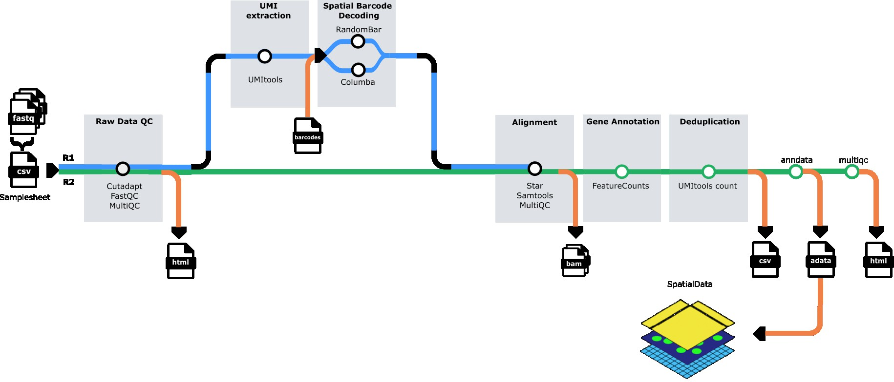

<h1>
  <picture>
    <source media="(prefers-color-scheme: dark)" srcset="docs/images/nf-core-panoramaseq_logo_dark.png">
    
  </picture>
</h1>

[](https://github.com/nf-core/panoramaseq/actions/workflows/ci.yml)
[](https://github.com/nf-core/panoramaseq/actions/workflows/linting.yml)[](https://nf-co.re/panoramaseq/results)[](https://doi.org/10.5281/zenodo.XXXXXXX)
[](https://www.nf-test.com)

[](https://www.nextflow.io/)
[](https://docs.conda.io/en/latest/)
[](https://www.docker.com/)
[](https://sylabs.io/docs/)
[](https://cloud.seqera.io/launch?pipeline=https://github.com/nf-core/panoramaseq)

[](https://nfcore.slack.com/channels/panoramaseq)[](https://twitter.com/nf_core)[](https://mstdn.science/@nf_core)[](https://www.youtube.com/c/nf-core)

## Introduction

**nf-core/panoramaseq** is a bioinformatics pipeline for processing sequencing-based spatial transcriptomics data from in-situ arrays. The pipeline performs quality control, barcode calling, UMI extraction, read alignment, feature quantification, and generates analysis-ready AnnData (H5AD) files for downstream spatial transcriptomics analysis.

The pipeline handles paired-end FASTQ files from spatial transcriptomics experiments, performs GPU-accelerated barcode identification using QUIK, quantifies gene expression with UMI deduplication, and outputs spatially-resolved count matrices in H5AD format compatible with popular single-cell analysis tools like Scanpy and Seurat.

## Pipeline summary

1. **Quality Control** - Raw read QC ([`FastQC`](https://www.bioinformatics.babraham.ac.uk/projects/fastqc/))
2. **Subsampling** (optional) - Downsample reads for testing ([`seqtk`](https://github.com/lh3/seqtk))
3. **Barcode Calling** - GPU-accelerated spatial barcode identification ([`QUIK`](https://github.com/your-repo/quik))
4. **UMI Extraction** - Extract UMI sequences from reads ([`UMI-tools`](https://github.com/CGATOxford/UMI-tools))
5. **Adapter Trimming** - Multi-stage adapter and quality trimming ([`Cutadapt`](https://cutadapt.readthedocs.io/))
6. **Read Alignment** - Align reads to reference genome ([`STAR`](https://github.com/alexdobin/STAR))
7. **Feature Quantification** - Assign reads to genes ([`featureCounts`](http://subread.sourceforge.net/))
8. **UMI Counting** - Deduplicate and count UMIs per gene ([`UMI-tools`](https://github.com/CGATOxford/UMI-tools))
9. **H5AD Generation** - Create spatially-resolved count matrices ([`AnnData`](https://anndata.readthedocs.io/))
10. **H5AD Validation** - Validate output files (custom validation)
11. **Quality Reports** - Aggregate QC metrics ([`MultiQC`](http://multiqc.info/))


## Usage

> [!NOTE]
> If you are new to Nextflow and nf-core, please refer to [this page](https://nf-co.re/docs/usage/installation) on how to set-up Nextflow. Make sure to [test your setup](https://nf-co.re/docs/usage/introduction#how-to-run-a-pipeline) with `-profile test` before running the workflow on actual data.

### Samplesheet input

You will need to create a samplesheet with information about the samples you would like to analyze before running the pipeline. Use this parameter to specify its location with `--input`.

The samplesheet has to be a comma-separated file with 5 columns and a header row as shown in the example below:

```csv
sample,fastq_1,fastq_2,N_barcodes,barcode_file
SAMPLE_1,/path/to/sample1_R1.fastq.gz,/path/to/sample1_R2.fastq.gz,34500,/path/to/barcodes_coords.csv
SAMPLE_2,/path/to/sample2_R1.fastq.gz,/path/to/sample2_R2.fastq.gz,34500,/path/to/barcodes_coords.csv
```

| Column         | Description                                                                                                               |
| -------------- | ------------------------------------------------------------------------------------------------------------------------- |
| `sample`       | Custom sample name. This will be used to name all output files. Spaces are not allowed.                                 |
| `fastq_1`      | Path to FASTQ file for read 1. File must be gzipped and have the extension `.fastq.gz` or `.fq.gz`.                    |
| `fastq_2`      | Path to FASTQ file for read 2. File must be gzipped and have the extension `.fastq.gz` or `.fq.gz`.                    |
| `N_barcodes`   | Number of expected spatial barcodes for this sample (e.g., 34500 for standard arrays).                                  |
| `barcode_file` | Path to CSV file containing spatial barcode sequences and their coordinates. Must include barcode sequences in column 1.|

An [example samplesheet](./assets/samplesheet.csv) has been provided with the pipeline.

### Reference genome

The pipeline requires a reference genome and annotation files. You can specify these in multiple ways:

#### Option 1: Provide pre-built STAR index

```bash
--star_genome_dir /path/to/star_index/
--star_gtf /path/to/annotation.gtf
```

#### Option 2: Build index from FASTA and GTF

```bash
--fasta /path/to/genome.fasta
--star_gtf /path/to/annotation.gtf
```

The pipeline will automatically build the STAR index from the provided FASTA file.

#### Option 3: Use iGenomes reference (if configured)

```bash
--genome GRCh38
```

### Running the pipeline

The typical command for running the pipeline is as follows:

```bash
nextflow run nf-core/panoramaseq \
   --input samplesheet.csv \
   --outdir results \
   --star_genome_dir /path/to/star_index \
   --star_gtf /path/to/annotation.gtf \
   -profile singularity
```

This will launch the pipeline with the `singularity` configuration profile. See below for more information about profiles.

### GPU Requirements and Configuration

The pipeline uses GPU-accelerated barcode calling via QUIK, which requires NVIDIA GPUs and CUDA libraries. **You must configure GPU settings by modifying the pipeline's `nextflow.config` file to match your system.**

#### For UGent HPC Users (Joltik/Accelgor clusters)

**Step 1: Set up environment variables** (add to your `~/.bashrc` or run before each session):

```bash
export NXF_HOME=$VSC_DATA_VO_USER/.nextflow
export APPTAINER_CACHEDIR=$VSC_SCRATCH_VO_USER/.apptainer/cache
export APPTAINER_TMPDIR=$VSC_SCRATCH_VO_USER/.apptainer/tmp
export SINGULARITY_CACHEDIR=$VSC_SCRATCH_VO_USER/.apptainer/cache
```

**Step 2: Modify the pipeline's `nextflow.config` file** by adding this GPU configuration at the end:

```bash
# Navigate to the pipeline directory
cd /path/to/nf-core-panoramaseq

# Edit nextflow.config and add the following at the end of the file:
```

```groovy
// GPU configuration for UGent HPC (Joltik/Accelgor)
process {
    withLabel: use_gpu {
        beforeScript = 'module load cuDNN/9.5.0.50-CUDA-12.6.0'
        clusterOptions = { "--gpus=1 --clusters=joltik,accelgor" + (System.getenv("SBATCH_ACCOUNT") || System.getenv("SLURM_ACCOUNT") ? " --account=" + (System.getenv("SBATCH_ACCOUNT") ?: System.getenv("SLURM_ACCOUNT")) : "") }
    }
}
```

**Step 3: Run the pipeline**:

```bash
nextflow run main.nf \
   --input samplesheet.csv \
   --outdir results \
   --star_genome_dir /path/to/star_index \
   --star_gtf /path/to/annotation.gtf \
   -profile vsc_ugent,singularity
```

#### For Other HPC Systems

**Step 1: Check available CUDA modules**:

```bash
module spider CUDA
module spider cuDNN
```

**Step 2: Modify the pipeline's `nextflow.config` file** by adding GPU configuration at the end:

```bash
# Navigate to the pipeline directory
cd /path/to/nf-core-panoramaseq

# Edit nextflow.config and add this at the end:
```

```groovy
// GPU configuration for your HPC system
process {
    withLabel: use_gpu {
        // Load your system's CUDA module (CUDA 12.6.0 or compatible)
        beforeScript = 'module load CUDA/12.6.0'  // Adjust version for your system
        
        // Configure GPU allocation for your scheduler (SLURM example)
        clusterOptions = '--gpus=1'  // Adjust for your scheduler (PBS/SGE/etc)
        
        // Enable GPU access in containers
        containerOptions = {
            workflow.containerEngine == "singularity" ? '--nv' : 
            ( workflow.containerEngine == "docker" ? '--gpus all': null )
        }
    }
}
```

**Step 3: Run the pipeline**:

```bash
nextflow run main.nf \
   --input samplesheet.csv \
   --outdir results \
   --star_genome_dir /path/to/star_index \
   --star_gtf /path/to/annotation.gtf \
   -profile singularity
```

#### Important Notes

- The QUIK container is pre-built with CUDA 12.6.0 runtime
- Your system must have CUDA drivers version 12.6 or higher
- Add the GPU configuration to the **end** of the pipeline's `nextflow.config` file (this overrides institutional defaults)
- GPU jobs will be scheduled on GPU-enabled nodes based on your `clusterOptions`
- The pipeline requires at least 1 GPU for QUIK barcode calling

### Execution Profiles

The pipeline requires **Singularity/Apptainer** for QUIK barcode calling due to the GPU-accelerated pre-built container requirement.

#### Singularity Profile (Required for QUIK)

```bash
nextflow run main.nf --input samplesheet.csv -profile singularity
```

**Requirements:**
- ✅ Singularity/Apptainer container engine
- ✅ NVIDIA GPU with CUDA support

**Advantages:**
- ✅ Fast GPU-accelerated barcode calling (~0.75ms per read)
- ✅ Consistent environment across systems
- ✅ No compilation overhead
- ✅ Recommended for HPC systems

**QUIK Performance:**
- Compiled with: `SEQUENCE_LENGTH=36`, `REJECTION_THRESHOLD=8`
- Performance: ~0.75ms per read on NVIDIA Tesla V100 GPU
- ~10-20x faster than runtime compilation

#### Docker Profile

```bash
nextflow run main.nf --input samplesheet.csv -profile docker
```

**Notes:**
- Uses same pre-built QUIK container as Singularity profile
- Requires Docker daemon and GPU plugin for GPU access
- Not recommended for HPC systems (Singularity preferred)

### Combined Profiles

You can combine profiles for your specific setup:

```bash
# UGent HPC with GPU (recommended)
nextflow run main.nf -profile vsc_ugent,singularity

# Generic HPC with GPU
nextflow run main.nf -profile singularity

# Test run with singularity
nextflow run main.nf -profile test,singularity
```

### Key parameters

#### Subsampling

To subsample FASTQ files for faster testing or analysis:

```bash
--sample_size 400000  # Subsample to 400,000 reads per file
```

#### QUIK barcode calling

The pipeline uses GPU-accelerated QUIK for fast and accurate barcode calling via the pre-built Singularity container.

**Container:**
- Pre-built container: `oras://quay.io/francoaps/quik-cuda:prebuilt-36bp-v2`
- Base: NVIDIA CUDA 12.6.0 on Ubuntu 22.04
- Engine: Singularity/Apptainer (required)

**Fixed parameters** (compiled at container build time):
- `barcode_length`: 36bp (compiled with `SEQUENCE_LENGTH=36`)
- `rejection_threshold`: 8 (compiled with `REJECTION_THRESHOLD=8`)

**Configurable parameters** (set at runtime):

```bash
--barcode_start 9                        # Start position of barcode in read (default: 9)
--strategy '4_7_mer_gpu_v1'              # Barcode matching strategy (default: 4_7_mer_gpu_v1)
--distance_measure 'SEQUENCE_LEVENSHTEIN' # Distance metric for matching (default: SEQUENCE_LEVENSHTEIN)
```

**Performance:**
- ~0.75ms per read on NVIDIA Tesla V100 GPU
- Optimized with pre-built binary in container

**Requirements:**
- NVIDIA GPU (Tesla V100 or equivalent)
- Singularity/Apptainer container engine
- CUDA drivers 12.6 or compatible

**If you need different barcode length or threshold:**
- You must rebuild the container from the Singularity definition file (`containers/quik_cuda_prebuilt.def`) with different compile-time parameters
- The pre-built binary cannot be reconfigured at runtime

#### UMI tools

Configure UMI extraction:

```bash
--umitools_bc_pattern 'NNNNNNNNN'     # UMI barcode pattern (default: 9 N's)
--umitools_extract_method 'string'    # Extraction method (default: string)
```

#### Output options

```bash
--mergecounts true         # Merge all samples into single H5AD file (default: true)
--validate_h5ad true       # Validate H5AD files after creation (default: true)
--skip_multiqc false       # Skip MultiQC report generation (default: false)
```

> [!WARNING]
> Please provide pipeline parameters via the CLI or Nextflow `-params-file` option. Custom config files including those provided by the `-c` Nextflow option can be used to provide any configuration _**except for parameters**_; see [docs](https://nf-co.re/docs/usage/getting_started/configuration#custom-configuration-files).

For more details and further functionality, please refer to the [usage documentation](https://nf-co.re/panoramaseq/usage) and the [parameter documentation](https://nf-co.re/panoramaseq/parameters).

## Pipeline output

The pipeline generates several types of output files organized in directories by analysis step:

### Main outputs

- **`h5ad/`** - Spatially-resolved count matrices in AnnData H5AD format
  - Individual sample H5AD files (if `mergecounts=false`)
  - Merged H5AD file with all samples (if `mergecounts=true`)
  - Validation logs for each H5AD file

- **`multiqc/`** - Comprehensive quality control report
  - `multiqc_report.html` - Interactive HTML report with all QC metrics

### Intermediate outputs

- **`fastqc/`** - Per-sample FastQC reports at multiple stages (raw, post-UMI, post-trim)
- **`quik/`** - Barcode calling results and statistics
- **`star/`** - STAR alignment outputs (BAM files and indices)
- **`samtools/`** - Sorted and indexed BAM files
- **`UMI_counts/`** - Per-gene UMI count tables (TSV format)
- **`pipeline_info/`** - Execution reports and pipeline metadata

For more details about the output files and reports, please refer to the
[output documentation](https://nf-co.re/panoramaseq/output).

To see the results of an example test run with a full size dataset refer to the [results](https://nf-co.re/panoramaseq/results) tab on the nf-core website pipeline page.

## Credits

nf-core/panoramaseq was originally written by [Franco Poma-Soto](https://github.com/francops1722).

### Contributors

We thank the following people for their contributions to the development of this pipeline:

- **Franco Poma-Soto** - Pipeline development and implementation
- **QUIK Development Team** - GPU-accelerated barcode calling module
- **nf-core community** - Framework, templates, and guidance
- **Nicolas Vannieuwkerke** - For advice and reviewing  

### Institutional Support

This pipeline was developed with support from:
- Ghent University
- CMGG Center for Medical Genetics of Ghent

## Contributions and Support

If you would like to contribute to this pipeline, please see the [contributing guidelines](.github/CONTRIBUTING.md).

For further information or help, don't hesitate to get in touch on the [Slack `#panoramaseq` channel](https://nfcore.slack.com/channels/panoramaseq) (you can join with [this invite](https://nf-co.re/join/slack)).

## Citations

If you use nf-core/panoramaseq for your analysis, please cite it using the following DOI: [10.5281/zenodo.XXXXXX](https://doi.org/10.5281/zenodo.XXXXXX)

### Pipeline tools

This pipeline uses the following software and tools. Please cite them appropriately in your publications:

- **QUIK** - Uphoff, R.C., Schüler, S., Grosse, I., & Müller-Hannemann, M. (2025). QUIK: GPU-accelerated barcode calling for spatial transcriptomics. _bioRxiv_. doi: [10.1101/2025.05.12.653416](https://doi.org/10.1101/2025.05.12.653416)

- **FastQC** - Andrews, S. (2010). FastQC: A Quality Control Tool for High Throughput Sequence Data.
  
- **MultiQC** - Ewels, P., et al. (2016). MultiQC: summarize analysis results for multiple tools and samples in a single report. _Bioinformatics_, 32(19), 3047-3048.

- **UMI-tools** - Smith, T., et al. (2017). UMI-tools: modeling sequencing errors in Unique Molecular Identifiers to improve quantification accuracy. _Genome Research_, 27(3), 491-499.

- **Cutadapt** - Martin, M. (2011). Cutadapt removes adapter sequences from high-throughput sequencing reads. _EMBnet.journal_, 17(1), 10-12.

- **STAR** - Dobin, A., et al. (2013). STAR: ultrafast universal RNA-seq aligner. _Bioinformatics_, 29(1), 15-21.

- **Subread (featureCounts)** - Liao, Y., et al. (2014). featureCounts: an efficient general purpose program for assigning sequence reads to genomic features. _Bioinformatics_, 30(7), 923-930.

- **SAMtools** - Li, H., et al. (2009). The Sequence Alignment/Map format and SAMtools. _Bioinformatics_, 25(16), 2078-2079.

- **seqtk** - Li, H. (2012). seqtk: a fast and lightweight tool for processing FASTA or FASTQ sequences. Available at: https://github.com/lh3/seqtk

- **AnnData** - Virshup, I., et al. (2021). anndata: Annotated data. Available at: https://anndata.readthedocs.io/

An extensive list of references for the tools used by the pipeline can be found in the [`CITATIONS.md`](CITATIONS.md) file.

You can cite the `nf-core` publication as follows:

> **The nf-core framework for community-curated bioinformatics pipelines.**
>
> Philip Ewels, Alexander Peltzer, Sven Fillinger, Harshil Patel, Johannes Alneberg, Andreas Wilm, Maxime Ulysse Garcia, Paolo Di Tommaso & Sven Nahnsen.
>
> _Nat Biotechnol._ 2020 Feb 13. doi: [10.1038/s41587-020-0439-x](https://dx.doi.org/10.1038/s41587-020-0439-x).
